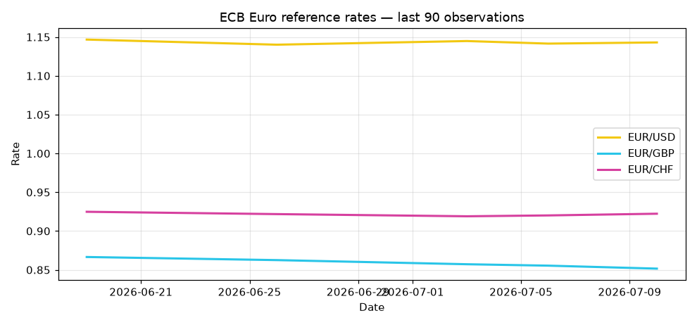

# 📈 EUR FX Tracker

An automated pipeline that pulls the latest **ECB euro reference rates** (via the
key-free [Frankfurter API](https://www.frankfurter.app/)), maintains a running history,
regenerates a trend chart, and refreshes this page. Runs on a schedule — every commit is a
real data update, not a placeholder.

**Stack:** Python · pandas · matplotlib · scheduled automation (Windows Task Scheduler / GitHub Actions).

<!--RATES_START-->
**ECB reference date:** 2026-06-19  ·  **Last refreshed:** 2026-06-22 13:07 UTC  ·  **Observations tracked:** 1

| Pair | Rate |
|------|------|
| EUR/USD | 1.1467 |
| EUR/GBP | 0.8665 |
| EUR/JPY | 184.8800 |
| EUR/CHF | 0.9248 |
| EUR/INR | 108.1675 |

<!--RATES_END-->
